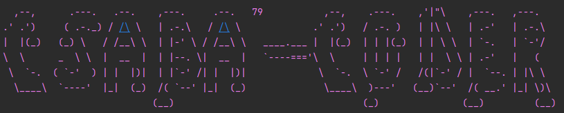

# Online Shopping Microservice Application

## Created by Modules

- Product Service (uses MongoDB)
- Order Service (uses MySQL server) - test uses H2 in memory database
- Inventory Service (uses MySQL server) - test uses H2 in memory database
- Discovery Server - Eureka Server
- API Gateway
- Keycloak (Authorization Server)

## Setup (Environment variables)

- Please feel free to use your own setup!

| Name                                             | Value        | Remark            | Extra remark                                                                                                    |
|--------------------------------------------------|--------------|-------------------|-----------------------------------------------------------------------------------------------------------------|
| MYSQL_DB_PORT                                    | 3306         | default           | used for MySQL                                                                                                  |
| MONGO_DB_PORT                                    | 27017        | default           | used for MongoDB                                                                                                |
| MYSQL_DB_URL<br/>Example:<br/>MYSQL_DB_URL_ORDER | no such info | pls use your own!       | used for all MySQL Database separate database for scaling! added additionally with underscore the service name! |
| MYSQL_DB_USER                                    | no such info         | default           | pls use your own if you have set any other, default value is: root                                              |
| MYSQL_DB_PASSWORD                                | no such info | pls use your own! | [MYSQL Installation Guide](https://dev.mysql.com/doc/mysql-installation-excerpt/5.7/en/)                        |


## Keycloak: (port set: 8181 -> feel free to set your own! watch out for the configs though!)

```docker run -p 8181:8080 -e KEYCLOAK_ADMIN=admin -e KEYCLOAK_ADMIN_PASSWORD=admin quay.io/keycloak/keycloak:20.0.3 start-dev```

