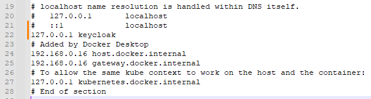

# Online Shopping Microservice Application

## Created by Modules

- Product Service (uses MongoDB)
- Order Service (uses MySQL server) - test uses H2 in memory database
- Inventory Service (uses MySQL server) - test uses H2 in memory database
- Discovery Server - Eureka Server
- API Gateway
- Keycloak (Authorization Server)
- Notification Service uses Kafka (using Event Driven Architecture)

## Other extra implementations:

- Circuit Breaker (using Resilience4j - library inspired by: Netflix Hystrix) implemented in Order Service
- Distributed Tracing (set TraceId -> for whole request and SpanId -> for services) -> using: Observability with MicroMeter (instead of deprecated Spring Cloud Sleuth) -> Zipkin for UI

## Setup (Environment variables)

- Please feel free to use your own setup!

| Name                                             | Value        | Remark            | Extra remark                                                                                                    |
|--------------------------------------------------|--------------|-------------------|-----------------------------------------------------------------------------------------------------------------|
| MYSQL_DB_PORT                                    | 3306         | default           | used for MySQL                                                                                                  |
| MONGO_DB_PORT                                    | 27017        | default           | used for MongoDB                                                                                                |
| MYSQL_DB_URL<br/>Example:<br/>MYSQL_DB_URL_ORDER | no such info | pls use your own!       | used for all MySQL Database separate database for scaling! added additionally with underscore the service name! |
| MYSQL_DB_USER                                    | no such info         | default           | pls use your own if you have set any other, default value is: root                                              |
| MYSQL_DB_PASSWORD                                | no such info | pls use your own! | [MYSQL Installation Guide](https://dev.mysql.com/doc/mysql-installation-excerpt/5.7/en/)                        |


## Keycloak: (port set: 8181 -> feel free to set your own! watch out for the configs though!)

```docker run -p 8181:8080 -e KEYCLOAK_ADMIN=admin -e KEYCLOAK_ADMIN_PASSWORD=admin quay.io/keycloak/keycloak:18.0.0 start-dev```

## Open Zipkin (url: http://localhost:9411/zipkin/): 

```docker run -d -p 9411 openzipkin/zipkin:latest``` or ```docker run -d -p 9411:9411 openzipkin/zipkin:latest```

Zipkin POST endpoint: http://localhost:9411/api/v2/spans

Easier to read: ```brew install jq```

## Docker for Kafka (from main project):

```docker compose up -d```

Check docker up and running: ```docker ps```

Check Kafka logs: ```docker logs -f broker```

## Dockerize the Project

Tool: Docker-compose

Create the Dockerfile and in terminal: ```docker build -t apigateway-dockerfile .```

Check image: ```docker images```

Build Docker Layer: ```docker build -t apigateway-layered -f Dockerfilelayered .```

Creating Docker Container image with using Jib ```mvn clean compile jib:build```

Use jib:dockerBuild if you don't want to push it!

To push to DockerHub: ```docker push csaba79coder/online-shopping:tagname```
```docker tag local-image:tagname new-repo:tagname```
```docker push new-repo:tagname```

DockerHub login from terminal: ```docker login -u "myusername" -p "mypassword" docker.io```

To pull and run all the docker compose images from DockerHub (daemon mode):

```docker compose up -d```

Check the service if it is running: ```docker logs -f order-service``` (like checking Kafka)

Every time we restart the docker new Client Secret will be generated for the Client (spring-cloud-client)

with opening Keycloak through localhost:8080 we can log to keycloak, and get the Client Secret!

API call from Postman:

Without API Gateway implemented (direct keycloak call): 

http://localhost:8181/realms/spring-boot-microservices-realm/protocol/openid-connect/token

After API Gateway implemented: 

http://localhost:8080/realms/spring-boot-microservices-realm/protocol/openid-connect/token

From docker through API Gateway: 

http://keycloak:8080/realms/spring-boot-microservices-realm/protocol/openid-connect/token

Do not forget tho change:

```C -> Windows -> System32 -> drivers -> etc -> filename: hosts ```

for Postman to be able to get the Secret Key add this line:

```127.0.0.1 keycloak```



## Monitoring MicroService (Prometheus -> in memory database & Grafana -> UI dashboard)

Prometheus endpoint: ```/actuator/prometheus```

Grafana endpoint: ```localhost:3000```

Recompile Docker using Jib: ```mvn clean compile jib:build```

In case of war projects use bellow: ```mvn clean package jib:build```

After login to Grafana add datasource (Prometheus) -> named as e.g.: Prometheus Microservices

Define Prometheus' url: ```http://prometheus:9090```

Next step to create a Dashboard in Grafana for Prometheus (better to import an existing one): 

Find under main project named: Grafana_Dashboard.json -> the content must be copied to: Import via  panel json -> load -> select datasource (as you named it, choose that one!) -> click: import
